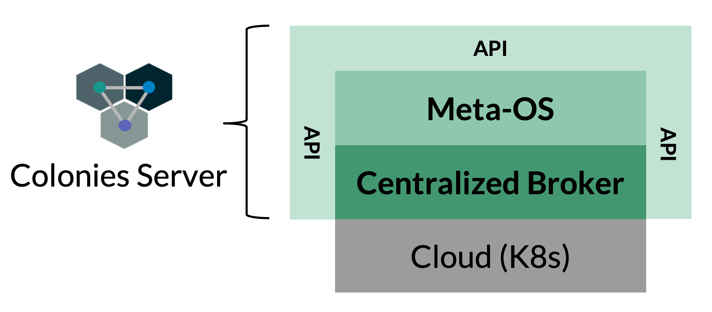
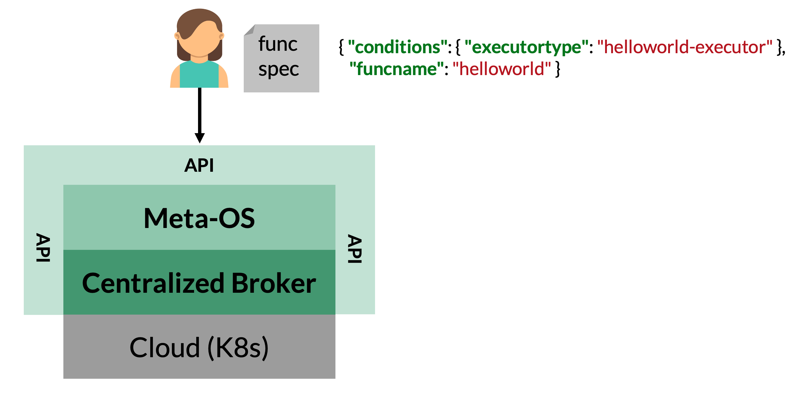
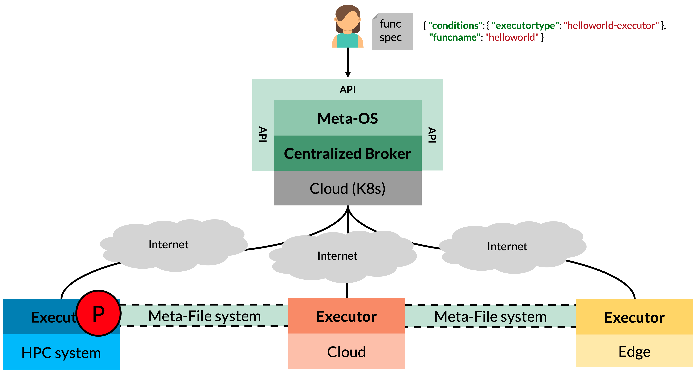
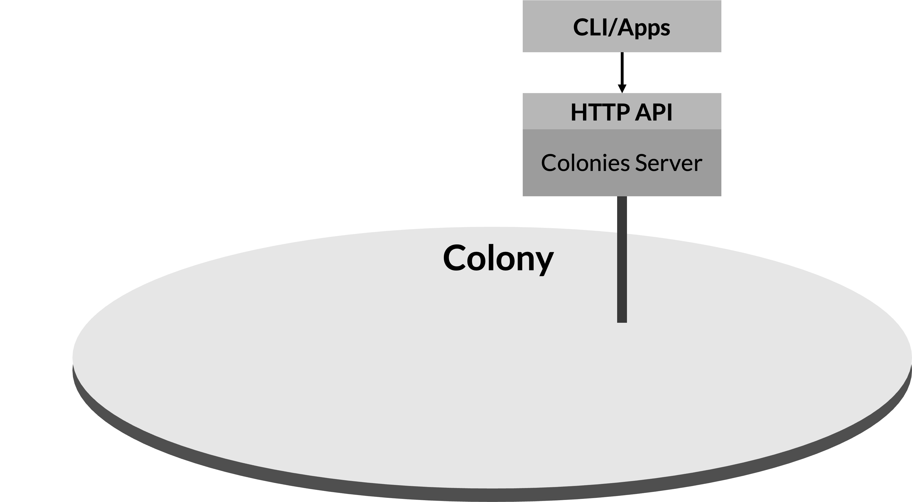
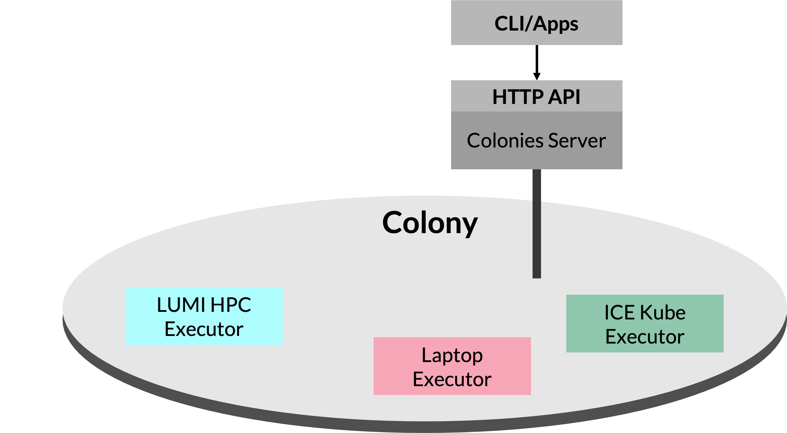

What is ColonyOS?
=================
ColonyOS is a Meta-OS, offering functionalities like a traditional OS, but operates as an overlay on top of existing platforms and OSs. This unique capability can be used to bridge the gap between various computing environments and enables seamless integration and execution of cross-platform workflows. 

ColonyOS build on the principle of *service brokering* and acts as a intermediary between users and various platforms. This makes it possible to hide or *abstract away* the complexity of underlying platforms and streamline execution of workloads. The ultimate goal is to make it possible to develop platform-independent and portable applications.

ColonyOS is somewhat similar to `grid computing <https://en.wikipedia.org/wiki/Grid_computing>`_, but takes another approach in grid network creation and resource allocation. Unlike traditional grid computing, which typically focuses on establishing a single, extensive grid computing network, ColonyOS is based on cloud-computing and adopts an application-specific approach where each application operates its own smaller, self-contained grid, referred to as a *colony*. The colony is then provisioned with only the resources necessary to efficiently execute a certain application, avoiding the one-size-fits-all approach of larger grid networks. 

From another point of view, a colony can also be viewed as a `distributed service mesh <https://en.wikipedia.org/wiki/Service_mesh>`_. This architecture allows for the hosting of microservices across a wide array of platforms dispersed throughout the Internet. By doing so, it offers a more flexible and resilient environment where services can communicate and operate efficiently despite being hosted on different technologies and platforms.

Colonies servers
================

ColonyOS consists of Colonies servers, offering a modern HTTP API globally accessible from anywhere on the Internet. Users then submit so-called *function specifications* to a Colonies server, describing functions to be executed by a so-called *executor*. A built-in brokering system part of the Colonies server then assigns the function specification to an executor capable of executing the function.

Executors
=========

Executors can be seen as `microservices <https://en.wikipedia.org/wiki/Microservices>`_, each being lightweight, independent, and tasked with executing only specific functions. Executors register their capabilities with the Colonies server, specifying the functions they can execute. Executors do not interact with other executors, and is designed according to the Unix philosophy - *Do one thing well and do it well*. This modular approach makes it possible to decouple complex systems into distinct functions, each of which can be independently developed and managed by different teams, thereby enhancing scalability and maintainability.

.. image:: img/howdoesitwork2.png 

Executors must specify its *type* when registering with the Colonies server. If multiple executors of the same type exist within the colony, the Colonies server then load balances function assignments, distributing functions evenly among executors of that type. Should an executor fail to execute a function within a specified timeframe, the function specification is reassigned to another executor of the same type, ensuring task completion and system reliability. This failsafe mechanism allows for easy system updates by simply replacing an executor, as ColonyOS ensures all functions are eventually executed by reassigning failed functions to other executors.

Functions
=========

To execute a function, users or external applications submit function specifications to the Colonies server. These specifications contain meta-information describing how to execute the function. The executor assigned the function specification interprets the specification and performs some kind of computation. 

When the Colonies server receives a function specification, the function specification is encapsulated into process that includes contextual details such as the assigned executor and start time. The process is stored in a database with a timestamp, effectively turning the database into a queue. Consequently, users can submit functions targetting an executor that do not yet exist.

The figure above illustrates how an executor execute a process. The function specification part of the process record, can also contain instructions how to fetch and synchronize data. This is done using a built-in meta-filesystem part of ColonyOS.

Colony
======

A colony in ColonyOS is a *distributed computing system* comprised of loosely-connected executors, which may be geographically dispersed across Internet and deploy on varios platforms, *yet collectively form a cohesive compute unit*. Applications based on ColonyOS do not interact directly with an individual executor. Instead, they operate indirectly by submitting function specifications to the Colonies server. The server hence acts as an intermediary, enabling implementation of a loosely connected system.

This loosely connected system architecture offers numerous benefits:

* **Scalability:** The system can be scaled simply by deploying more executors, allowing the system to adapt to varying workload demands.
* **Load Balancing:** The Colonies server can distribute tasks among executors efficiently, ensuring optimal utilization of resources and preventing any single executor from becoming a bottleneck.
* **Resilience:** Executors can crash or be restarted without affecting entire ColonyOS applications.
* **Upgrades:** Executors can be individually updated, facilitating Continuous Deployment and Integration (CD/CI) without disrupting the overall system.
* **Reduced complexity:** ColonyOS applications are relieved from handling platform integration complexities, as this is managed by the executors. This breakdown into smaller, independent executors allows for easier development and integration across various platforms.
* **Modularity:** Different teams can develop and manage different executors, promoting modular development and potentially speeding up development processes.
* **Flexibility:** Executors' ability to operate on different platforms enhances the system's adaptability to diverse computing environments and requirements.
* **Cost-effectiveness:** By using resources only when needed and allowing for the use of diverse, potentially less expensive hardware, ColonyOS can be a more cost-effective solution compared to traditional centralized systems.

The figure above shown above depicts an empty colony, where no executors are currently connected. Importantly, it highlights the capability of the system to accept and queue function specifications from applications, even in the absence of active executors. These submitted functions are held in a queue and will be promptly executed as soon as an executor connects to the colony, ensuring no disruption in the processing of tasks despite the initial lack of executors. This feature underscores the flexibility and resilience of the ColonyOS architecture.

In the figure above, the colony now includes three executors: the *LUMI HPC Executor* for executing containers on HPC systems, the *ICE Kube Executor* for running containers on Kubernetes, and the *Laptop Executor* for running containers on a local laptop. This demonstrates the dynamic nature of ColonyOS, where executors of varied types and capabilities can be added dynamically to the colony without disrupting the functioning of ColonyOS applications. This flexibility allows for a versatile and adaptable computing environment. For example, it becomes possible to develop an application that can automatically harness spot cloud resources to reduce costs.

Security
========
A key component of ColonyOS is a crypto identity protocol, inspired by Bitcoin and Ethereum. Each user, colony and executor is assigned a digital identity verified by the Colonies server using `implicit certificates <https://en.wikipedia.org/wiki/Implicit_certificate>`_ implicit certificates based on `Elliptic-curve cryptography <https://en.wikipedia.org/wiki/Elliptic-curve_cryptography>`_. This setup enables the reconstruction of public keys from signatures, and identities are then calculated as cryptographic hashes (SHA3-256) of these reconstructed public keys. The Colonies server doesn't store private keys but keeps the identities in a database, verifying that identities reconstructed from RPC calls match those stored. This ensures secure and authenticated interactions within the ColonyOS environment.

This protocol works as follows. Let's assume a user has the following id, and the Colonies server has stored the id in its internal database.

.. code-block:: console
    
    69383f17554afbf81594999eec96adbaa0fc6caace5f07990248b14167c41e8f

To add a colony, the user (or Colonies SDK) calculates a signature of the message using the user's private key and sends the RPC message to the Colonies server.

.. code-block:: json 

   {
       "payloadtype": "addcolonymsg",
       "payload": "ewogICAgICBjb2xvbnlpZDogYWM4ZGM4OTQ5YWYzOTVmZDUxZWFkMzFkNTk4YjI1MmJkYTAyZjFmNmVlZDExYWNlN2ZjN2RjOGRkODVhYzMyZSwKICAgICAgbmFtZTogdGVzdF9jb2xvbnlfbmFtZQogIH0=",
       "signature": "82f2ba6368d5c7d0e9bfa6a01a8fa4d4263113f9eedf235e3a4c7b1febcdc2914fe1f8727746b2f501ceec5736457f218fe3b1a469dd6071775c472a802aa81501",
   }
  

Upon receiving the RPC message, the Colonies server reconstructs the identity from the received data. It then cross-verify the reconstructed identity against its database to verify if the caller possesses the necessary rights to add a new colony. This process ensures that only authorized users can access the system.

Access control
--------------
In ColonyOS, there are four defined roles, each with specific responsibilities and levels of access:

* **Colonies server owner:** Analogous to super root user, this role involves owning and maintaining the server.
* **Colony owner:** Comparable to root users, they are individuals or entities owning individual colonies. One server can host multiple colonies.
* **Colony user members:** Members of a specific colony, potentially ranging from one to several in each colony.
* **Colony executor members:** Executors within a specific colony, with each colony possibly having multiple executors.

In ColonyOS, each role is associated with a private key, and specific rules determine how these roles 
can interact with the Colonies server:

* Server owner rules:
    - Only the server owner can register a new colony.
    - Only the server owner can list all registered colonies.
* Colony owner rules:
    - Only a colony owner can register a user or executor to their colony.
    - Only a colony owner can approve or disapprove an executor within their colony.
* User rules:
    - Any user member of a colony can submit, get, and list processes or workflows within their colony.
* User/executor rules:
    - Any executor member of a colony can submit, get, assign, and list processes or workflows within their colony.
    - Only the executor that was assigned a process can set attributes on that process or mark it as complete/failed.
