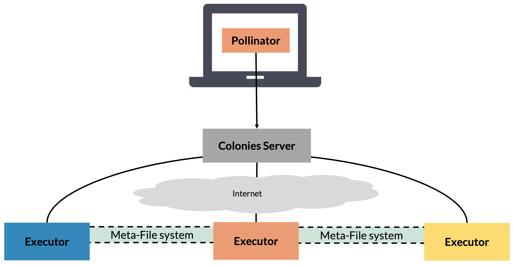

Introduction
============
**Pollinator** is a `Platform-as-a-Service <https://en.wikipedia.org/wiki/Platform_as_a_service>`_  (PaaS) tool, 
much like `Heroku <https://www.heroku.com>`_, but is based on ColonyOS to execute containers across platforms. 

While Heroku mainly targets deployment of web applications in the Cloud, **Pollinator** is designed to simplify and 
streamline job execution across platforms, e.g executing AI computations on HPC, Edge, or Kubernetes platforms. 
**Pollinator** is also designed to ensure uniform workload execution across these diverse platforms.

**Pollinator** significantly simplifies interactions with HPC or Kubernetes systems. For instance, it completely 
eliminates the need to manually login to HPC nodes to run Slurm jobs. It seamlessly synchronizes and transfers data from the 
user's local filesystem to remote Executors, offering the convenience of a local development environment while 
harnessing powerful supercomputers and cloud platforms. With **Pollinator**, users are no longer required to have 
in-depth knowledge of Slurm or Kubernetes systems, speeding up development and making powerful HPC systems available to more people.

How does it work?
-----------------
Pollinator assumes the existance of the directories in the table below.  

+---------------+---------------------------------------------+-------------------------------------------------------------+
| Directory     | Purpose                                     | Synchronization Strategy                                    |
+===============+=============================================+=============================================================+
| ./cfs/src     | Contains source code or binaries            | Will be synchronized from local computer to remote          |
|               | to be executed                              | executor before execution                                   |
+---------------+---------------------------------------------+-------------------------------------------------------------+
| ./cfs/data    | Datasets or other data is stored here       | Will be synchronized from local computer before             |
|               |                                             | execution, but not removed after job completion             |
+---------------+---------------------------------------------+-------------------------------------------------------------+
| ./cfs/result  | Produced data can be stored here.           | Will be synchronized from remote executor to local          |
|               |                                             | computer after execution                                    |
+---------------+---------------------------------------------+-------------------------------------------------------------+

#. Synchronize the source, data, and result directories to the ColonyOS meta-filesystem.
#. Generate a ColonyOS function specification based on the ``project.yaml`` file.
#. Automatically generate and submit a ColonyOS function specification to a Colonies server.
#. If the job is assigned to an HPC Executor:

   a. Pull the Docker container to the HPC environment, and convert it to a Singularity container.
   b. Synchronize the source, data, and result directories to make the project file accessible on the remote HPC environment.
   c. Generate a Slurm script to execute the Singularity container, including binding the source, data, and result directories to the container.
   d. Execute and monitor the Slurm job, including uploading all standard outputs and error logs to a Colonies server.
   e. Close the process by making a request to the Colonies server.

#. If the job is assigned to a remote Kubernetes Executor:

   a. Synchronize the source, data, and result directories to a shared Persistent Volume.
   b. Generate and deploy a K8s batch job.
   c. Monitor the execution of the batch job, including uploading logs to a Colonies server.
   d. Close the process by making a request to the Colonies server.

Getting started
---------------
To use **Pollinator**, you to have access to a colony where a **KubeExecutor** or an **HPCExecutor** is available. The following
environmental varialble must be set:

ColonyOS credentials (private keys and S3 keys) and configurations are available as 
environmental variables. It also assumes the existance of an HPC Executor named **lumi-standard-hpcexecutor**, connected
to the LUMI standard CPU partition.

.. code-block:: console

    export COLONYOS_DASHBOARD_URL="..."
    export COLONIES_TLS="true"
    export COLONIES_SERVER_HOST="..."
    export COLONIES_SERVER_PORT="443"
    export COLONIES_COLONY_NAME="..."
    export COLONIES_PRVKEY="..."
    export AWS_S3_ENDPOINT="..."
    export AWS_S3_ACCESSKEY="..."
    export AWS_S3_SECRETKEY="..."
    export AWS_S3_REGION_KEY=""
    export AWS_S3_BUCKET="..."
    export AWS_S3_TLS="true"
    export AWS_S3_SKIPVERIFY="false"

Creating a new project
----------------------
As an example, we are going to run some Python code at the `LUMI <https:///www.lumi-supercomputer.eu>`_ supercomputer in Finland. 
When creating a new project, we must specify an **executor type**. Let's list which executor is available in the colony:

.. code-block:: console

    +----------------------+------------------------------+----------------+
    |         NAME         |             TYPE             |    LOCATION    |
    +----------------------+------------------------------+----------------+
    | icekube              | ice-kubeexecutor             | ICE Datacenter |
    | lumi                 | lumi-small-hpcexecutor       | CSC, Finland   |
    | garage-supercomputer | dev-hpcexecutor              | Rutvik, Sweden |
    | leonardo             | leonardo-booster-hpcexecutor | Cineca, Italy  |
    +----------------------+------------------------------+----------------+

Next, let's generate a new **Pollinator** project with **lumi-small-hpcexecutor** as target executor.

.. code-block:: console

    mkdir lumi
    cd lumi
    pollinator new -e lumi-small-hpcexecutor

.. code-block:: console

    INFO[0000] Creating directory                            Dir=./cfs/src
    INFO[0000] Creating directory                            Dir=./cfs/data
    INFO[0000] Creating directory                            Dir=./cfs/result
    INFO[0000] Generating                                    Filename=./project.yaml
    INFO[0000] Generating                                    Filename=./cfs/data/hello.txt
    INFO[0000] Generating                                    Filename=./cfs/src/main.py

The generated 

.. code-block:: yaml

     projectid: 11bdf92c7560bee1d8c154504427bfbb9483aabf130b60f17de5d88a5d5f4ece
     conditions:
       executorType: lumi-small-hpcexecutor
       nodes: 1
       processesPerNode: 1
       cpu: 1000m
       mem: 1000Mi
       walltime: 600
       gpu:
         count: 0
         name: ""
     environment:
       docker: python:3.12-rc-bookworm
       rebuildImage: false
       cmd: python3
       source: main.py

The generated **main.py**.

.. code-block:: python 

     import os
     import socket
     
     # Print the hostname
     hostname = socket.gethostname()
     print("hostname:", hostname)
     
     # The projdir is the location on the executor where project dirs have been synced
     projdir = str(os.environ.get("PROJECT_DIR"))
     
     # The processid is the unique id of the process where this code will execute at a remove executor
     processid = os.environ.get("COLONIES_PROCESS_ID")
     
     print("projdir:", projdir)
     print("processid:", processid)
     
     # Open the hello.txt file and print the content
     file = open(projdir + "/data/hello.txt", 'r')
     contents = file.read()
     print(contents)
     
     # Write the result to the a file in the result dir
     result_dir = projdir + "/result/"
     os.makedirs(result_dir, exist_ok=True)
     
     file = open(result_dir + "/result.txt", "w")
     file.write("Hello, World!")
     file.close()
     
