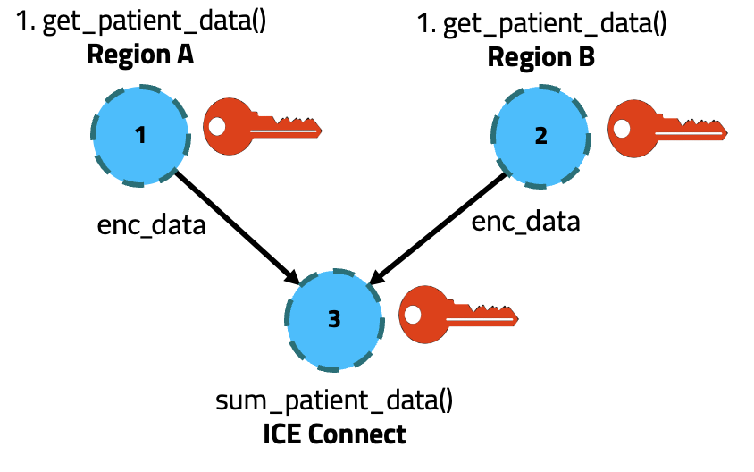

Getting started
===============

Installing 

Develop an executor
===================

With a private key
------------------

Self-registration 
-----------------

Use case - Secure Multi-party Computation 
=========================================

This is an example of how to use ColonyOS to execute cross-platform workflows for Secure Multi-party Computation. 
We will explore a use case that demonstrates Homomorphic encryption on medical data. The source code can be found `here <https://github.com/johankristianss/colonyos-he-example>`_.

Let's assume we have three sites:

* Hospital (Region A
* Hospital (Region B)
* A cloud provider (ICE Connect).

The cloud provider should be able to execute certain mathematical operations (in this case calculate a sum) on the encryped patient data 
obtained from the both hospitals. With homomorphic encryption, the cloud provider only has access to encrypted data without ever accessing 
the actual, sensitive patient data. 

Now, we aim to streamline the entire process of acquiring encrypted patient data from both hospitals, performing the sum computation, and then 
decrypting the final result. The computation we aim to perform can be represented as the following Directed Acyclic Graph (DAG):

We are going to utilize the Paillier homomorphic encryption protocol, which works as follows:

#. 1. A user generate a private/public key pair.
#. 2. The user sends the public key to the hospitals.
#. 3. Each hospital retrieves patient data through database queries, encrypts this data using the provided public key. 
      This ensures the confidentiality of the patient information.
#. 4. Each hospital then sends the encrypted data to the cloud provider.
#. 5. The cloud provider calculates a sum of the encrypted data — without ever decrypting it, thus preserving the privacy of the information.
#. 6. The cloud provider sends the encrypted result back to the user.
#. 7. Finally, the user decrypts the result using the private key to obtain the plaintext outcome of the computation.

This process is shown in the figure below:

.. image:: img/python_usecase_arch.png 

We are going to develop two types of ColonyOS executors. 
1. A Hospital executor, responbible for getting patient data. The hospital executor is going to provide a Colonies function called **get_patient_data**.
2. A Cloud executor, responisible for calculating the sum. The cloud provider is going to provide a Colonies function called **sum_patient_data**.

We are going the pass the Paillier enbcryption key through the DAG as an argument to the workflow. The JSON code below describes the DAG:

.. code-block:: console

    [
        {
            "nodename": "r1:get_patent_data",
            "conditions": {
                "executortype": "r1-hospital_executor",
                "dependencies": []
            },
            "funcname": "get_patient_data",
            "kwargs": {
                "paillier-pubkey": "eyJuIjogIjQwNDI...."
            },
            "maxexectime": 600,
            "maxretries": 3
        },
        {
            "nodename": "r2:get_patent_data",
            "conditions": {
                "executortype": "r2-hospital_executor",
                "dependencies": []
            },
            "funcname": "get_patient_data",
            "kwargs": {
                "paillier-pubkey": "eyJuIjogIjQwNDI...."
            },
            "maxexectime": 600,
            "maxretries": 3
        },
        {
            "nodename": "cloud:sum_patent_data",
            "conditions": {
                "executortype": "cloud-hospital-executor",
                "dependencies": [
                    "r1:get_patent_data",
                    "r2:get_patent_data"
                ]
            },
            "funcname": "sum_patient_data",
            "kwargs": {
                "paillier-pubkey": "eyJuIjogIjQwNDI...."
            },
            "maxexectime": 600,
            "maxretries": 3
        }
    ]

Run the example
---------------

First, start the first Hospital executor. The first argument is the name of executor. The second argument is the secret patient data.

.. code-block:: console
    
    python3 hospital_executor.py r2-hospital_executor 5  

Start the second Hospital executor.

.. code-block:: console

    python3 hospital_executor.py r1-hospital_executor 55  

And finally start the cloud provider executor.

.. code-block:: console

    python3 cloud_executor.py  

Submit the workflow.

.. code-block:: console

    colonies workflow submit --spec workflow/workflow.json 

We can also look at the DAG in the ColonyOS dashboard.

.. image:: img/python_usecase_dashboard1.png 
.. image:: img/python_usecase_dashboard2.png 

Note the input and out field of the last process in the DAG. 
The input field contains the encrypted patient data generated by the Hospital executors. The outout field contains the encrypted sum. 

To get the result we need to decrypt the output from the last process in the DAG.

.. code-block:: console
    
    python3 decrypt.py 8e7823ff8d0f8a167480199d070a43a6ad88894a45137d3837f34789580d5035

.. code-block:: console

    The sum of all patient data is: 60

Paillier Homomorphic encryption in Python
^^^^^^^^^^^^^^^^^^^^^^^^^^^^^^^^^^^^^^^^^
.. code-block:: python 

    from phe import paillier
    
    # Sensitive medical data
    private_data = {
        'patient_data1': 15,
        'patient_data2': 25
    }
    
    # Generate public and private keys for Paillier encryption
    public_key, private_key = paillier.generate_paillier_keypair()
    
    # Encrypt each site's private data using the public key
    encrypted_data = [public_key.encrypt(value) for value in private_data.values()]
    
    # The central authority sums the encrypted values
    encrypted_sum = sum(encrypted_data, start=public_key.encrypt(0))
    
    # The encrypted sum is then decrypted with the private key
    total_sum = private_key.decrypt(encrypted_sum)
    
    print(f"The sum of all site data is: {total_sum}")
