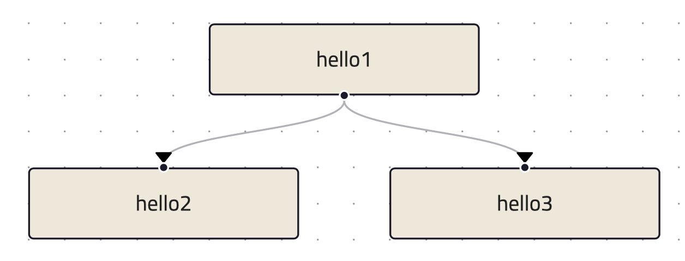

Getting started
===============
This tutorial explains how to implement an executor in Python. This also provides insight into the internal workings of ColonyOS making
it easier to the utilize pre-developed executors, such as various container executors.

This tutorial describes how to implement an executor in Python. This also understanding how ColonyOS works internally
when using already developed executors, such as different container executors.

First, follow instructions at :doc:`colonies-cli` and install the ``colonies`` binary.

Starting a Colonies server
--------------------------
First, follow instructions at :doc:`install`. 
In short:

.. code-block:: console

    git clone https://github.com/colonyos/colonies.git
    source docker-compose.env
    docker-compose up

Installing Python SDK
---------------------

Note that the SDK has only be tested on Linux and MacOS.

.. code-block:: console
    
    pip3 install pycolonies

Connecting to a Colonies server
===============================
The code below configures a Python client to connect to a Colonies server running at ``localhost:50080``.

.. code-block:: python

   from pycolonies import Colonies
           
   colonies = Colonies("localhost", 50080)

To be able to use the client and Python SDK, the following settings is required:

* A name of colony.
* A valid private key of a user or executor member of the colony.
* Optionally, a colony private key to register new executors or users. 

An alternative method is to use the ``colonies_client()`` function. It will parse the 
following environmental variables:

* ``COLONIES_SERVER_HOST``
* ``COLONIES_SERVER_PORT``
* ``COLONIES_SERVER_TLS``
* ``COLONIES_COLONY_NAME``
* ``COLONIES_EXECUTOR_NAME``
* ``COLONIES_PRVKEY``
* ``COLONIES_COLONY_PRVKEY``

Just make sure to ``source docker-compose.env`` before starting the Python script.

.. code-block:: python

   from pycolonies import colonies_client
   
   colonies, colonyname, colony_prvkey, executorname, prvkey = colonies_client()

Registering an executor
=======================

The first step to register an executor is to create a new ECDSA key pair.

.. code-block:: python
       
    from pycolonies import Crypto

    crypto = Crypto()
    executor_prvkey = crypto.prvkey()
    executorname = crypto.id(executor_prvkey)

The ``executor_id`` is essentially a SHA3-256 hash of the public key, which itself is generated from the private key. The Colonies server derives the public key from message signatures to reconstruct the ``executor_id``. It then searches for the ``executor_id`` in its internal database to verify whether the executor is an authorized member of the colony. The ``executor_id`` must therefore be specified when registering a new executor. Additionally, only the colony owner has the authority to add an executor. Consequently, the ``add_executor()`` function requires the colony's private key as an argument.

Note that the process of adding an executor in done in two steps. Once an executor is added, it need to be approved by calling ``approve_executor()`` function in order to get process assignments.

.. code-block:: python

    executor = {
        "executorname": executorname,
            "executorid": executorid,
            "colonyname": colonyname,
            "executortype": "helloworld-executor"
        }
        
    try:
        executor = self.colonies.add_executor(executor, colony_prvkey)
        self.colonies.approve_executor(self.colonyname, executorname, colony_prvkey)
            
        self.colonies.add_function(colonyname, 
                                   executorname, 
                                   "helloworld",  
                                   executor_prvkey)
    except Exception as err:
        print(err)
        os._exit(0)
        
    print("Executor", executorname, "registered")

Process assignments
===================
An executor can get a process assignments by calling the assign() function. The function takes executor_prvkey as argument and a 
timeout how long time the call should block, in this case 10 seconds.

.. code-block:: python

    process = colonies.assign(self.colonyname, 10, self.executor_prvkey)

The ``process`` object contains the following information:

.. code-block:: python

    {'processid': '9a580b18c9a6cb9716097ff02dd54b4bb18177e8241fafc1f5c919e421b5b586', 
     'initiatorid': '3fc05cf3df4b494e95d6a3d297a34f19938f7daa7422ab0d4f794454133341ac', 
     'initiatorname': 'myuser', 
     'assignedexecutorid': '50900712cb50da8e14ef45aabb037c56a94264a6948da71344228645f2267a21', 
     'isassigned': True, 
     'state': 1, 
     'prioritytime': 1703010866089369404, 
     'submissiontime': '2023-12-19T19:34:26.089369+01:00', 
     'starttime': '2023-12-19T18:35:43.513739591Z', 
     'endtime': '0001-01-01T00:53:28+00:53', 
     'waitdeadline': '0001-01-01T00:53:28+00:53', 
     'execdeadline': '0001-01-01T00:53:28+00:53', 
     'retries': 0, 
     'attributes': [], 
     'spec': {'nodename': '', 'funcname': 'helloworld', 'args': [], 'kwargs': {}, 'priority': 0, 'maxwaittime': -1, 'maxexectime': -1, 'maxretries': 0, 'conditions': {'colonyname': 'dev', 'executorids': [], 'executortype': 'helloworld-executor', 'dependencies': [], 'nodes': 0, 'cpu': '', 'processes': 0, 'processes-per-node': 0, 'mem': '', 'storage': '', 'gpu': {'name': '', 'mem': '', 'count': 0, 'nodecount': 0}, 'walltime': 0}, 'label': '', 'fs': {'mount': '', 'snapshots': None, 'dirs': None}, 'env': {}}, 
     'waitforparents': False, 
     'parents': [], 
     'children': [], 
     'processgraphid': '', 
     'in': [], 
     'out': [], 
     'errors': []}

Once a process is assigned to an executor, that executor gains exclusive access to it. Each process can be assigned to only one executor, and only the executor assigned to a specific process has the right to add logs, attributes or close it. The following code demonstrates how to close an assigned process with the output ``helloworld``.

.. code-block:: python

    if process["spec"]["funcname"] == "helloworld":
        self.colonies.close(process["processid"], ["helloworld"], executor_prvkey)

Complete example
================

.. code-block:: python

   from pycolonies import Crypto
   from pycolonies import Colonies
   from pycolonies import colonies_client
   import signal
   import os
   import uuid 
   
   class PythonExecutor:
       def __init__(self):
           colonies, colonyname, colony_prvkey, executorname, prvkey = colonies_client()
           self.colonies = colonies
           self.colonyname = colonyname
           self.colony_prvkey = colony_prvkey
           self.executorname = "helloworld-executor"
           self.executortype = "helloworld-executor"
   
           crypto = Crypto()
           self.executor_prvkey = crypto.prvkey()
           self.executorid = crypto.id(self.executor_prvkey)
   
           self.register()
           
       def register(self):
           executor = {
               "executorname": self.executorname,
               "executorid": self.executorid,
               "colonyname": self.colonyname,
               "executortype": self.executortype
           }
           
           try:
               executor = self.colonies.add_executor(executor, self.colony_prvkey)
               self.colonies.approve_executor(self.colonyname, self.executorname, self.colony_prvkey)
               
               self.colonies.add_function(self.executorname, 
                                          self.colonyname, 
                                          "helloworld",  
                                          self.executor_prvkey)
           except Exception as err:
               print(err)
               os._exit(0)
           
           print("Executor", self.executorname, "registered")
           
       def start(self):
           while (True):
               try:
                   process = self.colonies.assign(self.colonyname, 10, self.executor_prvkey)
                   print("Process", process["processid"], "is assigned to executor")
                   if process["spec"]["funcname"] == "helloworld":
                       self.colonies.close(process["processid"], ["helloworld"], self.executor_prvkey)
               except Exception as err:
                   print(err)
                   pass
   
       def unregister(self):
           self.colonies.remove_executor(self.colonyname, self.executorname, self.colony_prvkey)
           print("Executor", self.executorname, "unregistered")
           os._exit(0)
   
   def sigint_handler(signum, frame):
       executor.unregister()
   
   if __name__ == '__main__':
       signal.signal(signal.SIGINT, sigint_handler)
       executor = PythonExecutor()
       executor.start()
  
Start the executor by typing:

.. code-block:: console

    python3 helloworld_executor.py

.. code-block:: console 

    Executor fca266fa7a5ca88a60129f6d19f189ce6f8ba086ec9b06e7eebe9350bd777dc0 registered

To call the ``helloworld`` function we need to submit the following function specification:

.. code-block:: json 

   {
       "conditions": {
           "executortype": "helloworld-executor"
       },
       "funcname": "helloworld"
   }

Note that the ``executortype`` must match executor type of the executor, which in our case is ``helloworld-executor``.

.. code-block:: console 

    colonies function submit --spec helloworld.json

Below is an alternative method to call the function:

.. code-block:: console 

   colonies function exec --func helloworld --targettype helloworld-executor

It is also possible to submit function specifications directly in Python. Save the Python code below to a
new file called ``helloworld.py``.

.. code-block:: python

   from pycolonies import FuncSpec, Conditions
   from pycolonies import colonies_client
   
   colonies, colonyname, colony_prvkey, executorname, prvkey = colonies_client()
   
   func_spec = FuncSpec(
        funcname="helloworld",
        conditions = Conditions(
            colonyname=colonyname,
            executortype="helloworld-executor"
        ),
        maxexectime=100,
        maxretries=3
   )
   
   # submit the function spec to the colonies server
   process = colonies.submit(func_spec, prvkey)
   print("Process", process["processid"], "submitted")
   
   # wait for the process to be executed
   process = colonies.wait(process, 10, prvkey)
   print(process["out"][0])

.. code-block:: console 

    python3 helloworld.py

.. code-block:: console 

    Process bacf4309da2f19db96e21c4ed16cda0b41e7045e6e81550d90d679725855ee71 submitted
    helloworld

Logs
====
Logs can simply be added by calling the `add_log()` function. Note that only the assigned executor may add logs.

.. code-block:: python 
    
   self.colonies.add_log(process["processid"], "Hello from executor\n", self.executor_prvkey)

.. code-block:: console

   colonies function submit --spec helloworld.json --follow
   INFO[0000] Process submitted                             ProcessId=c107281fceed8c7636debecca996bc8f714ca2301087e99a26fb7b93d5e5b4f9
   INFO[0000] Printing logs from process                    ProcessId=c107281fceed8c7636debecca996bc8f714ca2301087e99a26fb7b93d5e5b4f9
   Hello from executor
   INFO[0001] Process finished successfully                 ProcessId=c107281fceed8c7636debecca996bc8f714ca2301087e99a26fb7b93d5e5b4f9

Workflows
=========
Workflows are simply function specification with dependencies. The Python code below will create a workflow with 
the following shape.

.. code-block:: python 

   from pycolonies import colonies_client
   from pycolonies import Workflow, FuncSpec, Conditions
   import copy
  
   colonies, colonyname, colony_prvkey, executorid, executor_prvkey = colonies_client()
  
   hello1_func_spec = FuncSpec(
        funcname="helloworld",
        nodename="hello1",
        conditions = Conditions(
            colonyname=colonyname,
            executortype="helloworld-executor"
        ),
        maxexectime=100,
        maxretries=3
    )
   
    hello2_func_spec = FuncSpec(
        funcname="helloworld",
        nodename="hello1",
        conditions = Conditions(
            colonyname=colonyname,
            executortype="helloworld-executor"
            dependencies=["hello1"]
        ),
        maxexectime=100,
        maxretries=3
    )

    wf = Workflow(colonyname=colonyname)
    wf.functionspecs.append(hello1_func_spec)
    wf.functionspecs.append(hello2_func_spec)
   
    processgraph = colonies.submit_workflow(wf, prvkey)
    print("Workflow", processgraph.processgraphid, "submitted")

The ``hello1`` node must execute before the ``hello2`` process can run. Note that each process may call a function on any executor part of the same colony. This feature enables implementation of cross-platform workflows that 
operate seamlessly across a *continuum* of executors

Excercises
==========

Execution contraints
--------------------
Modify the ``maxexectime`` attribute in the function specification to 20 seconds, and add an additional delay — using ``sleep(30)`` — in the executor prior to closing the process.

.. code-block:: python
      
    import time

    def start(self):
        while (True):
            try:
                process = self.colonies.assign(self.colonyname, 10, self.executor_prvkey)

                time.sleep(30)  # the helloworld function now takes 30 seconds to complete

                print("Process", process["processid"], "is assigned to executor")
                if process["spec"]["funcname"] == "helloworld":
                    self.colonies.close(process["processid"], ["helloworld"], self.executor_prvkey)
            except Exception as err:
                print(err)
                pass

In this case, the process will be unassigned from the executor and immediately reassigned to the same executor. This will be repated
3 times (``maxretries``) until the process is closed as ``failed``.

Load balancing
--------------
Make it possible to start multiple executors by setting the ``executorname`` to a random number or making it possible to specify an 
executor name as an argument to the ``helloworld_executor.py`` script. Sumbit several function specifications and notice how the they become load balanced between the executors. 
