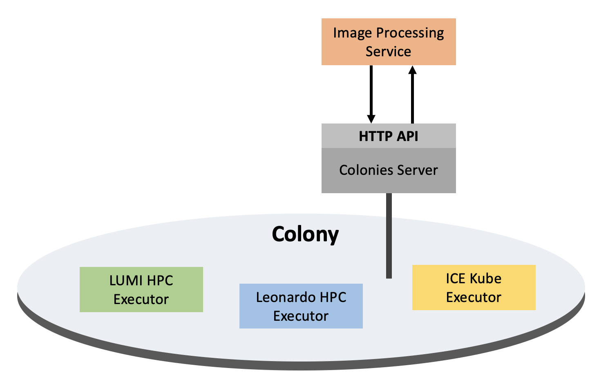

Image processing
================
In this tutorial we are going to develop a simple image processing engine.

Alternative 1
-------------
1. **Image Processing Service** synchronizes a picture to CFS.
2. **Image Processing Service** submits a *function spec* targeting an HPC Executor to process the image.
3. **HPC Executor** processes the image.
4. **Image Processing Service** wait for the process to finish, and get the result by looking up the *process Id*.
5. **Image Processing Service** remove the picture from CFS.

Alternative 2
-------------
1. **Image Processing Service** uploads the image to an **Image Server**.
2. **Image Processing Service** submits a *function spec* to an HPC Executor to process the image.
3. **HPC Executor** fetches the image from **Image Server**, and the processes the image.
4. **Image Processing Service** polls the the **Image Server** to get the results.
5. We 

