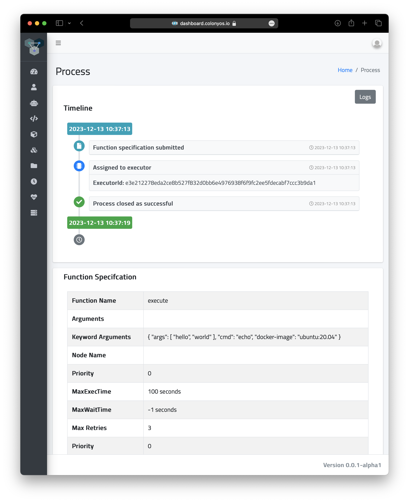

What is a container?
====================

A container is a lightweight, standalone, executable package that includes everything needed to run a piece of software, such as the code, a runtime, binaries, libraries, environment variables, and config files. Numerous container technologies have been developed to meet different requirements.

`Docker <https://www.docker.com>`_ containers are extensively used in a variety of computing environments. `Kubernetes <https://kubernetes.io>`_ a de facto standard container orchestration system, uses a container technology called `Containerd <https://containerd.io>`_ as a low-level interface for container management. Containerd is also utilized internally by Docker. In High-Performance Computing (HPC) environments, `Singularity <https://sylabs.io>`_ containers are often preferred for their specific features that is designed to meet specific HPC needs. Generally, different container technologies offer distinct toolsets and APIs.

Colony OS offers a way to run containers in a portable manner across platforms, independent of the underlying container technology, using a consistent API. This is achieved by submitting *function specifications* to a Colonies server, which then wraps the *specifications* into processes. A *process* is then assigned to a suitable executor, which subsequently launches a container on the underlying container platform where the executor is operating.

Within ColonyOS, there is a family of executors known as *container executors*. These implement a function called ``execute`` that spawns containers. As the format of the *function specification* is identical, it becomes possible to seamless switch between different platforms.

There are currently three types of *container executors*:

1. **Kube executor** spawns containers as Kubernetes batch jobs.  
2. **Docker executor** spawns containers as Docker containers on a baremetal servers or VMs.
3. **HPC executor** spawns containers as Singularity containers on HPC systems, managing them as Slurm jobs.

We are now going to explore how we can launch containers on various platforms.

Execute containers
==================

Follow instructions at :doc:`colonies-cli` and install the ``colonies`` and ``pollinator`` CLI tool.

In this tutorial, we assume that at least one *container executor* is available in the colony. 

Let's check which executors are currently available.

.. code-block:: console

   colonies executor ls

.. code-block:: console

   +----------------------+------------------------------+------------------------+
   |         NAME         |             TYPE             |        LOCATION        |
   +----------------------+------------------------------+------------------------+
   | lumi                 | lumi-small-hpcexecutor       | CSC, Finland           |
   | leonardo             | leonardo-booster-hpcexecutor | Cineca, Italy          |
   | icekube              | ice-kubeexecutor             | ICE Datacenter, Sweden |
   | garage-supercomputer | dev-hpcexecutor              | Rutvik, Sweden         |
   +----------------------+------------------------------+------------------------+

A *container executor* takes a Unix command, a list of arguments, and a Docker image as input. It then launches a container that executes the specified command. 
For example, to run the command ``echo "hello", "world"`` on an Ubuntu container we need to specify the following information:

.. code-block:: json 

    "funcname": "execute",
    "kwargs": {
        "cmd": "echo",
        "docker-image": "ubuntu:20.04"
        "rebuild-image": false,
        "args": [
            "hello", "world"
        ]
    }

To submit a *function specification*, we also need to specify requirements, so-called ``conditions``, on the executors that will execute the function. 
Additionally, we also need to define constraints on the execution, such as the expected execution time of the container. 
This aspect is particularly important for managing failures effectively. If the ``maxexectime`` is exceeded, meaning the process takes 
longer than anticipated, it will be unassigned and potentially reassigned to another executor. 
The ``maxretries`` parameter determines the number of times a process can be reassigned. 
The ``maxwaittime`` parameter specifies how long time process can wait in the queue before it is assigned and automatically failed. 
This approach ensures execution continuity and that processes runs to completion, even in cases of 
unexpected delays or failures. 

A process can have the following *states*:

* **Waiting** The process is submitted and enqueued at the Colonies server, waiting for an executor to be assigned and execute the process.
* **Running** The process is assigned to an executor.
* **Successful** The process has successfully been executed by an executor.
* **Failed** The process has failed when executed by one or several executors.

Now, let's execute the *echo* command specifed above. 

.. code-block:: json 

   {
       "conditions": {
           "executortype": "lumi-small-hpcexecutor",
           "nodes": 1,
           "processes-per-node": 1,
           "mem": "1Gi",
           "cpu": "500m",
           "walltime": 200,
           "gpu": {
               "count": 0
           }
       },
       "funcname": "execute",
       "kwargs": {
           "cmd": "echo",
           "docker-image": "ubuntu:20.04",
           "args": [
               "hello", "world"
           ]
       },
       "maxwaittime": -1,
       "maxexectime": 100,
       "maxretries": 3
   }

.. code-block:: console

   colonies function submit --spec echo.json --follow

The function will be execute by the ``lumi-small-hpcexecutor`` running on the LUMI supercomputer in Finland. If we change the ``executortype`` to
``ice-kubeexecutor`` it would instead run on a Kubernetes cluster at the ICE Datacenter in Sweden. 

.. code-block:: console

   INFO[0000] Process submitted                             ProcessId=50edc8ef92230aa984ed1cbc90c49c0834c3fad4766d6c88f3ceda24630cb0f8
   INFO[0000] Printing logs from process                    ProcessId=50edc8ef92230aa984ed1cbc90c49c0834c3fad4766d6c88f3ceda24630cb0f8
   hello world
   INFO[0007] Process finished successfully                 ProcessId=50edc8ef92230aa984ed1cbc90c49c0834c3fad4766d6c88f3ceda24630cb0f8

We can also lookup the process by typing the following command: 

.. code-block:: console
  
    colonies process get -p 50edc8ef92230aa984ed1cbc90c49c0834c3fad4766d6c88f3ceda24630cb0f8

.. code-block:: console

   Process:
   +--------------------+------------------------------------------------------------------+
   | ID                 | 50edc8ef92230aa984ed1cbc90c49c0834c3fad4766d6c88f3ceda24630cb0f8 |
   | IsAssigned         | True                                                             |
   | InitiatorID        | bcaeac1a507036f7fed0be9d38c43ba973be7c0064d1b0b010ede2f088093b3f |
   | InitiatorName      | johan                                                            |
   | AssignedExecutorID | e3e212278eda2ce8b527f832d0bb6e4976938f6f9fc2ee5fdecabf7ccc3b9da1 |
   | State              | Successful                                                       |
   | PriorityTime       | 1702460233177327634                                              |
   | SubmissionTime     | 2023-12-13 10:37:13                                              |
   | StartTime          | 2023-12-13 10:37:13                                              |
   | EndTime            | 2023-12-13 10:37:19                                              |
   | WaitDeadline       | 0001-01-01 00:53:28                                              |
   | ExecDeadline       | 2023-12-13 10:38:53                                              |
   | WaitingTime        | 17.103ms                                                         |
   | ProcessingTime     | 6.336683s                                                        |
   | Retries            | 0                                                                |
   | Input              |                                                                  |
   | Output             |                                                                  |
   | Errors             |                                                                  |
   +--------------------+------------------------------------------------------------------+
   
   FunctionSpec:
   +-------------+--------------------------------+
   | Func        | execute                        |
   | Args        | None                           |
   | KwArgs      | args:[hello world] cmd:echo    |
   |             | docker-image:ubuntu:20...      |
   | MaxWaitTime | -1                             |
   | MaxExecTime | 100                            |
   | MaxRetries  | 3                              |
   | Priority    | 0                              |
   +-------------+--------------------------------+
   
   Conditions:
   +------------------+------------------------+
   | ColonyName       | hpc                    |
   | ExecutorIDs      | None                   |
   | ExecutorType     | lumi-small-hpcexecutor |
   | Dependencies     |                        |
   | Nodes            | 1                      |
   | CPU              | 500m                   |
   | Memmory          | 1Gi                    |
   | Processes        | 0                      |
   | ProcessesPerNode | 1                      |
   | Storage          |                        |
   | Walltime         | 200                    |
   | GPU              |                        |
   | GPUs             | 0                      |
   | GPUMemory        |                        |
   +------------------+------------------------+
   
   Attributes:
   No attributes found

As ColonyOS stores process execution history in a database, we can also fetch the logs after process has finished.

.. code-block:: console

    colonies log get -p 50edc8ef92230aa984ed1cbc90c49c0834c3fad4766d6c88f3ceda24630cb0f8

.. code-block:: console

    hello world

Or we could look up the process in the ColonyOS dashboard:

Is can also be useful to get information about the execution history or list the queue. This is done using the ``colonies process`` command.
For example. the command below list the last 10 successful processes:

.. code-block:: console

    colonies process pss --count 10

.. code-block:: console

   '+----------+------+-------------------------+---------------------+------------------------------+----------------+
   | FUNCNAME | ARGS |         KWARGS          |      END TIME       |        EXECUTOR TYPE         | INITIATOR NAME |
   +----------+------+-------------------------+---------------------+------------------------------+----------------+
   | execute  |      | args:[30] cmd:sleep ... | 2023-12-13 10:51:47 | lumi-small-hpcexecutor       | johan          |
   | execute  |      | args:[hello world] c... | 2023-12-13 10:37:13 | lumi-small-hpcexecutor       | johan          |
   | execute  |      | args:[hello world] c... | 2023-12-13 10:37:09 | lumi-small-hpcexecutor       | johan          |
   | execute  |      | args:[hello world] c... | 2023-12-13 10:24:50 | ice-kubeexecutor             | johan          |
   | execute  |      | args:[hello  world] ... | 2023-12-13 09:56:07 | ice-kubeexecutor             | johan          |
   | execute  |      | docker-image:ubuntu:... | 2023-12-13 09:28:05 | ice-kubeexecutor             | johan          |
   | execute  |      | docker-image:ubuntu:... | 2023-12-13 09:27:23 | ice-kubeexecutor             | johan          |
   | execute  |      | args:[/cfs/fc752fe20... | 2023-12-12 22:29:26 | leonardo-booster-hpcexecutor | johan          |
   | execute  |      | cmd:python3 docker-i... | 2023-12-12 22:29:22 | leonardo-booster-hpcexecutor | johan          |
   | execute  |      | cmd:python3 docker-i... | 2023-12-12 22:29:25 | leonardo-booster-hpcexecutor | johan          |
   +----------+------+-------------------------+---------------------+------------------------------+----------------+

Alternativly, ``colonies process ps`` lists running processes, and ``colonies process psw`` lists waiting processes, and finally
``colonies process psf`` lists failed processes.

Now that you may have acquired some fundamental knowledge about running containers on ColonyOS, let's proceed to explore how to share data effectively across different container executors.

Managing data
=============

Let's create a directory, and 

Pollinator
==========
