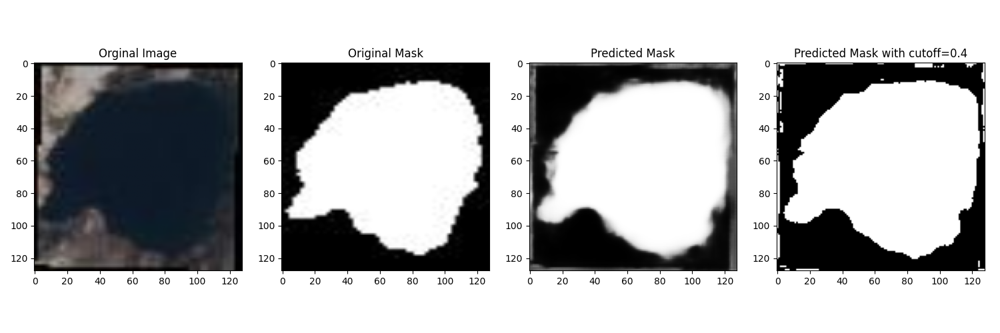
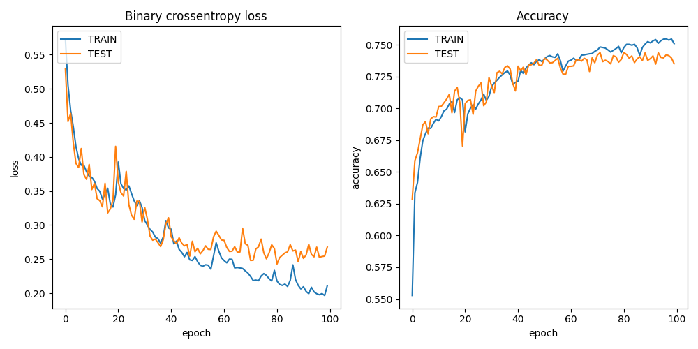

Introduction
============

In this tutorial, we will train a machine learning model to identify water in Sentinel-2 satellite images. 
We will be using code from `this GitHub repo <https://github.com/msoczi/unet_water_bodies_segmentation>`_ using 
this `dataset <https://www.kaggle.com/datasets/franciscoescobar/satellite-images-of-water-bodies/>`_.

Upload dataset
==============

We need a dataset to train the ML model. We will use the Colonies CFS to distribute the dataset to different executors.

Method 1 - Colonies CLI
-----------------------

Download the dataset and unzip the ``archive.zip`` file to directory named ``water_body_dataset``. 
Then, upload to the dataset files to Colonies CFS.

.. code-block:: console

    colonies fs sync -l /water -d ./water_body_dataset

.. code-block:: console
    
    | water_body_1114.jpg | 6 KiB    | /water |
    | water_body_1209.jpg | 10 KiB   | /water |
    | water_body_1273.jpg | 9 KiB    | /water |
    | water_body_1552.jpg | 61 KiB   | /water |
    | water_body_7797.jpg | 4 KiB    | /water |
    | water_body_8847.jpg | 9 KiB    | /water |
    | water_body_1313.jpg | 8 KiB    | /water |
    | water_body_1615.jpg | 18 KiB   | /water |
    | water_body_1724.jpg | 1 KiB    | /water |
    | water_body_1801.jpg | 8 KiB    | /water |
    | water_body_1833.jpg | 11 KiB   | /water |
    +---------------------+----------+--------+
    No files will be downloaded
    
    /water:
    =======
    No files will be uploaded
    No files will be downloaded
    
    Are you sure you want to continue? (yes,no):

After the upload has finished, we can now list the dataset.

.. code-block:: console

    colonies fs label ls
   
.. code-block:: console

   +---------------------------------------------------------+-----------------+
   |                           LABEL                         | NUMBER OF FILES |
   +---------------------------------------------------------+-----------------+
   | /water/Images                                           | 2841            |
   | /water/Masks                                            | 2841            |
   +---------------------------------------------------------+-----------------+

To access the dataset from an executor, the executor first needs to synchronize the data. This can be achieved in several ways; one method is to specify the ``/water`` label in the function specification fs section. The executor will then synchronize the dataset files to its local file system.

Alternatively, you can submit a function to an executor, requesting it to synchronize a specific label to its local file system without launching a container. 
The code below will download the dataset on the Leonardo HPC system. 

.. code-block:: json 

   {
       "conditions": {
           "executortype": "leonardo-booster-hpcexecutor",
           "nodes": 1,
           "processes-per-node": 1,
           "cpu": "1000m",
           "mem": "30Gi",
           "gpu": {
               "count": 0 
           },
           "walltime": 60000
       },
       "funcname": "sync",
       "fs": {
           "mount": "/cfs",
           "dirs": [
               {
                   "label": "/water",
                   "dir": "/water",
                   "keepfiles": true,
                   "onconflicts": {
                       "onstart": {
                           "keeplocal": false
                       },
                       "onclose": {
                           "keeplocal": true
                       }
                   }
               }
           ]
       },
       "maxwaittime": -1,
       "maxexectime": 60000,
       "maxretries": 3
   }

The data set will then be available in ``/cfs/water/Images/`` and ``/cfs/water/Masks/`` in the container running on Leonardo. 

.. code-block:: console

   colonies function submit --spec sync.json

Method 2 - Pollinator
---------------------

First, find a target executor.

.. code-block:: console

   +----------------------+------------------------------+------------------------+
   |         NAME         |             TYPE             |        LOCATION        |
   +----------------------+------------------------------+------------------------+
   | icekube              | ice-kubeexecutor             | ICE Datacenter, Sweden |
   | lumi                 | lumi-small-hpcexecutor       | CSC, Finland           |
   | garage-supercomputer | dev-hpcexecutor              | Rutvik, Sweden         |
   | leonardo             | leonardo-booster-hpcexecutor | Cineca, Italy          |
   +----------------------+------------------------------+------------------------+

Generate an empty working, targeting the LUMI HPC system. Note that the target executor type
can be changed later.

.. code-block:: console

   mkdir waterml
   cd waterml
   pollinator new -e lumi-small-hpcexecutor  

.. code-block:: console

   INFO[0000] Creating directory                            Dir=./cfs/src
   INFO[0000] Creating directory                            Dir=./cfs/data
   INFO[0000] Creating directory                            Dir=./cfs/result
   INFO[0000] Generating                                    Filename=./project.yaml
   INFO[0000] Generating                                    Filename=./cfs/data/hello.txt
   INFO[0000] Generating                                    Filename=./cfs/src/main.py

Copy the ``water_body_dataset`` to the ``./cfs/data`` directory  

.. code-block:: console
   
    cp ~/water_body_dataset ./cfs/data  

The dataset will upload next time the project run.

.. code-block:: console

   pollinator run --follow

.. code-block:: console

   Uploading main.py 100% [===============] (4.3 MB/s)
   Downloading water_body_8239.jpg 100% [===============] (248 kB/s)
   Downloading water_body_701.jpg 100% [===============] (484 kB/s)
   Downloading water_body_8159.jpg 100% [===============] (148 kB/s)
   Downloading water_body_683.jpg 100% [===============] (145 kB/s)
   Downloading water_body_967.jpg 100% [===============] (350 kB/s)
   Downloading water_body_784.jpg 100% [===============] (906 kB/s)
   Downloading water_body_922.jpg 100% [===============] (161 kB/s)
   Downloading water_body_233.jpg 100% [===============] (251 kB/s)
   Downloading water_body_1206.jpg 100% [===============] (720 kB/s)
   Downloading water_body_1708.jpg 100% [===============] (1.3 MB/s)
   Downloading water_body_2461.jpg 100% [===============] (560 kB/s)
   ...

The data set will then be available here in the running container:

.. code-block:: python

    projdir = os.environ.get("PROJECT_DIR")
    image_path = projdir + '/data/water/Images/'
    mask_path = projdir + '/data/water/Masks/'

Docker container
================

We are going the Container Executor, which comes in three variants. 

1. **KubeExector** runs containers as Kubernetes batch jobs.  
2. **DockerExector** runs containers as Docker containers on a baremetal servers or VMs.
3. **HPCExecutor** runs containers as Singularity containers on HPC systems, managing them as Slurm jobs.
   
As the *function specification* is identical, meaning that we can easily switch between these 3 types of executors.
To run containers, we first need to create a Dockerfile with the following content: 

.. code-block:: docker

   FROM docker.io/tensorflow/tensorflow:2.13.0-gpu

   RUN apt-get update && apt-get install -y python3 python3-pip wget vim git fish libgl1-mesa-glx libglib2.0-0
   RUN python3 -m pip install --upgrade pip
   RUN pip3 install pycolonies opencv-python tqdm Pillow scikit-learn keras matplotlib numpy

Build and publish the Dockerfile and publish the Docker image at public Docker registry.

.. code-block:: console

   docker build -t johan/hackaton .
   docker push johan/hackaton

The ``johan/hackaton`` Docker image has already been published at DockerHub.

Training the model
==================

Now that we have uploaded the dataset and created a Docker container, it's time to proceed with training the model.

Setup a Pollinator project
--------------------------

Create a new Pollinator project (or use the one you already created when uploading the dataset).
In the example, we assumed the ``water_dataset`` in available in Colonies CFS under the label ``/water``. 

.. code-block:: console 

   mkdir waterml
   cd waterml
   pollinator new -e leonardo-booster-hpcexecutor  

Edit the ``project.yaml`` file. Change the Docker image to ``johan/hackaton``, increase required memory to 
``30000Mi``, use 4 CPU cores (``4000m``). 

Walltime defined the maximum time the process may run. In this case, it has to finish in ``2000`` seconds.

.. code-block:: yaml 

   projectname: 559ac0c3a834594b337d10ebedf3134ea0ca3142cceab26b1aa5c17ba141999d
   conditions:
     executorType: leonardo-booster-hpcexecutor
     nodes: 1
     processesPerNode: 1
     cpu: 4000m
     mem: 30000Mi
     walltime: 2000
     gpu:
       count: 1
       name: ""
   environment:
     docker: johan/hackaton
     rebuildImage: false
     cmd: python3
     source: main.py

Replace main.py
---------------

Download source code from this `GitHub repo <https://github.com/johankristianss/colonyoshackaton/blob/main/src/main.py>`_.

.. code-block:: console 

    cd cfs/src
    wget https://raw.githubusercontent.com/johankristianss/colonyoshackaton/main/src/main.py .

At line 132, change epochs to e.g 30.

.. code-block:: python

   epochs = 30

Note that the Python code saves the training result and a random prediction example in the result directory, which is
automatically synchronized back to the client after process completion.

.. code-block:: python

    plt.savefig(projdir + '/result/res_' + processid + '.png')
    plt.savefig(projdir + '/result/samples_' + processid + '.png')

.. code-block:: console 

   ls cfs/result

.. code-block:: console 

   .rw-r--r--  55k johan 12 Dec 21:40 res_076e273a1d082dd2886892dfd7d1723e12c747cf2899f2c2ede27ceb55e06ae2.png
   .rw-r--r-- 266k johan 12 Dec 21:40 samples_076e273a1d082dd2886892dfd7d1723e12c747cf2899f2c2ede27ceb55e06ae2.png

Train the model
---------------

Pollinator will automatically synchronize the ``cfs/src``, ``cfs/data``, and ``cfs/result`` directories to Colonies CFS, generate
a *function specification* and then submit the *function specification*, follow the process execution, and upon completion, synchronize the 
project files back to your local computer.
 
.. code-block:: console 

    pollinator run --follow

.. code-block:: console 

   67/67 [==============================] - 1s 18ms/step - loss: 0.3434 - accuracy: 0.7024 - val_loss: 0.3263 - val_accuracy: 0.7038
   Epoch 25/30
   67/67 [==============================] - 1s 17ms/step - loss: 0.3307 - accuracy: 0.7092 - val_loss: 0.3146 - val_accuracy: 0.7121
   Epoch 26/30
   67/67 [==============================] - 1s 18ms/step - loss: 0.3139 - accuracy: 0.7140 - val_loss: 0.2947 - val_accuracy: 0.7249
   Epoch 27/30
   67/67 [==============================] - 1s 17ms/step - loss: 0.3226 - accuracy: 0.7110 - val_loss: 0.3027 - val_accuracy: 0.7244
   Epoch 28/30
   67/67 [==============================] - 1s 17ms/step - loss: 0.2994 - accuracy: 0.7208 - val_loss: 0.2910 - val_accuracy: 0.7259
   Epoch 29/30
   67/67 [==============================] - 1s 17ms/step - loss: 0.2910 - accuracy: 0.7239 - val_loss: 0.2781 - val_accuracy: 0.7261
   Epoch 30/30
   67/67 [==============================] - 1s 17ms/step - loss: 0.2856 - accuracy: 0.7258 - val_loss: 0.2733 - val_accuracy: 0.7313
   23/23 [==============================] - 0s 4ms/step
   
   INFO[0141] Process finished successfully                 ProcessID=61e597845ed3df4456c5be7d358e35141b8dc4c1f76a89d7caad0f31f792106c
   Downloading samples_076e273a1d082dd2886892dfd7d1723e12c747cf2899f2c2ede27ceb55e06ae2.png 100% [===============] (5.0 MB/s)
   Downloading res_076e273a1d082dd2886892dfd7d1723e12c747cf2899f2c2ede27ceb55e06ae2.png 100% [===============] (1.7 MB/s)

We can now open the sample and training plot pictures.

